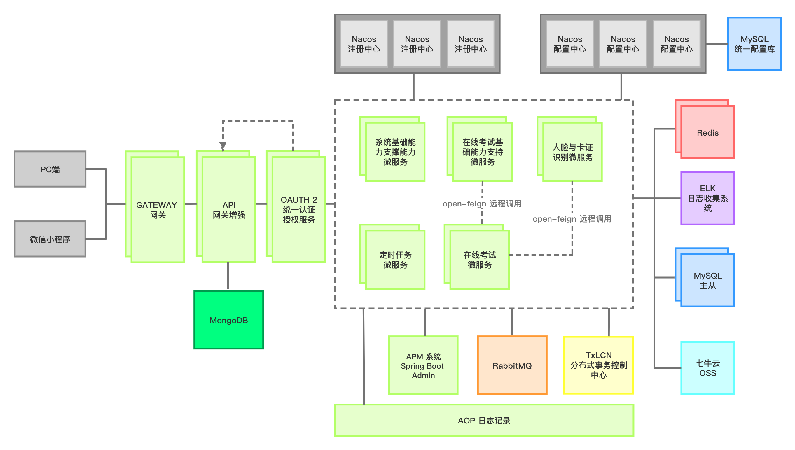

    </a>

  <strong>本科毕业设计 -  基于 Spring Cloud 的在线教育平台的分布式在线考试微服务平台服务端</strong> 

  <strong>易扩展，高性能</strong>

    
    
    
        
        

 

--------------------------------------------------------------------------------

# Architecture

   

--------------------------------------------------------------------------------

# Modules

 * oes-ai : Distributed image recognition and biological detection system, serving the identity authentication of users
 * oes-apm : Distributed system monitoring module, currently integrated with springboot-admin.
 * oes-auth : Microservice authentication server, using oauth2 protocol to achieve unified authentication and authorization.
 * oes-common : System common components and starter integration module
 * oes-gateway : Microservice gateway with extremely high performance
 * oes-oss : Object storage service, using Qiniu Cloud
 * oes-server : System business microservice integration module
 * oes-tx-manager : Distributed transaction management, base on TX-Manager
 * oes-server-system ： System business microservices, providing basic system capabilities
 * oes-server-exam-basic : Online examination business microservices, providing basic system capabilities
 * oes-server-exam-online ： Online examination microservices, provide online examination services, and integrate a large number of high-performance components to provide candidates with a Wenting examination environment

--------------------------------------------------------------------------------

# Features

   *  Whenever a request comes in ,Soul Execute all open plug-ins through the chain of responsibility.
   * The authentication server is separated from the resource server to facilitate access to your own microservice system
   * Gateway current limit, fault tolerance, degradation, gateway blacklist limit and gateway log
   * OAuth2.0 authentication and authorization, independent SSO single sign-on
   * Highly packaged Baidu, Alicard OCR optical recognition, face contrast recognition and other configurable solutions
   * Fully automated control of examination process and data processing scheme of message queue
   * Subjective similarity calculation and solution similarity streaming calculation solution
   * Multi-level modularization and externalization, configurable architecture design, integration of multiple design modes
   * Fully automated control of the examination process and message queue data processing program. Online examination
   * Identity verification, data desensitization, full-end monitoring of examination behavior and abnormal behavior log tracking and recording

--------------------------------------------------------------------------------

# Prerequisite

   * JDK 1.8+
   * Mysql
   * Redis
   * MongoDB

--------------------------------------------------------------------------------

# Third-party module

 * Nacos
 * Elasticsearch
 * Logstash
 * Kibana
 * Prometheus

--------------------------------------------------------------------------------

# Document & Website
In preparation.

  

 